# Pilates Paradise

[View Deployed Site Here](https://ajfriel86.github.io/ReelOfFortune/)

## About
This site is comprised of three main pages, and a thank you page. It is based on a slot machine game you would find in a casino. 
The landing page displays the rules for the game with a button that takes you to the game. 
The second page, or game page, displays the game.
The third page has a contact form.
The last page, which is only displayed once the form is submitted, displays a thank you message once the form has been submitted.

---

## User stories:
1. As a site user, I would like the site in English, so it is understandable to me

1. As a site user, I would like to play a game, for healthy brain stimulation 

1. As a site user, I am open-minded and willing to try new games, to help my mental health

1. As a site user, I am interested in games, as I enjoy the competitiveness 

1. As a site user, I wish to navigate the site easily, to make my experience more fun

1. As a site user, I would like the information to be clear, so I have a better understanding of what the game does

1. As a site user, I would like to know the game rules, so it makes the experience more fun

1. As a site user, I would like to be able to contact the company owner, if there are any bugs/issues with the game

1. As a site user, I would like to know where the company is, so I know how to contact them outside of the contact form

1. As a site user, I would like a reset function, in case of any mistakes/errors made by myself

### Site-Owner:

1. As a site owner, I would like the site to display all the necessary information for site users to understand

1. As a site owner, I would like the site to be designed with a games mindset, so it has a clear and concise design

1. As a site owner, I would like game rules to be displayed for site users to know how the game is played

1. As a site owner, I would like a contact form for site users so they can report any issues/bugs/errors

1. As a site owner, I would like users to feel comfortable using the site so they can navigate easily
---

## Features

1. Landing page

   - Upon visiting the site the initial page will display the game rules as well as a button "Let's Play." There is also a navigation bar, for the home page, game page, and contact page

    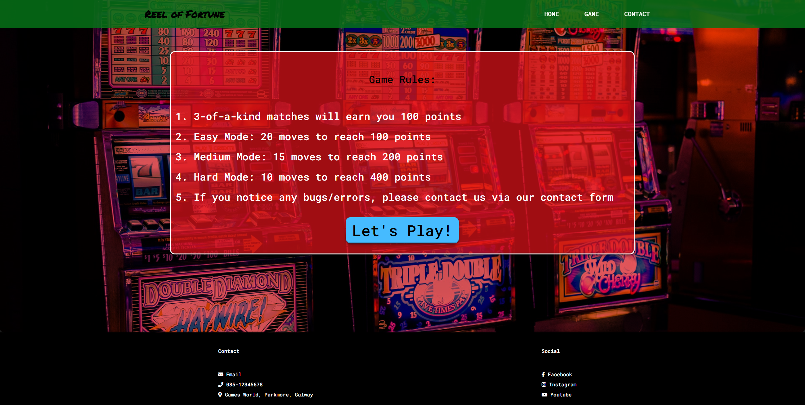
    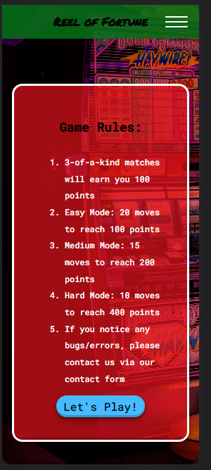

1. Game Page

    - The following page has the game reels where the user must match 3-of-a-kind, a spin button, and a reset button. There is also a navigation bar, for the home page, game page, and contact page

    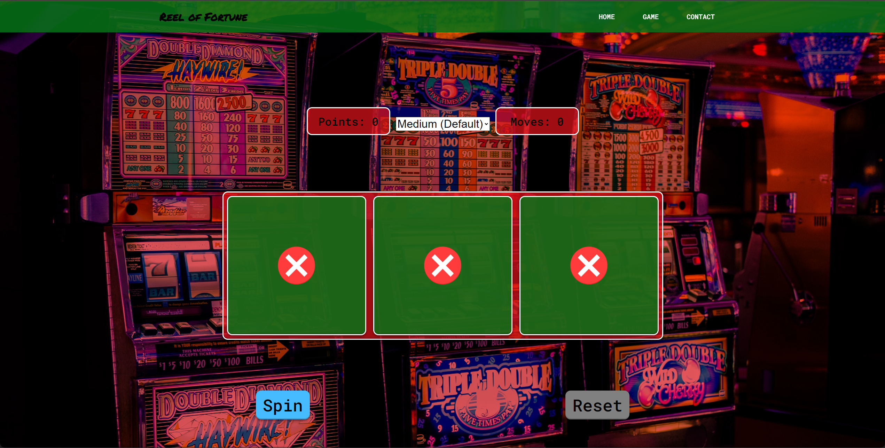
    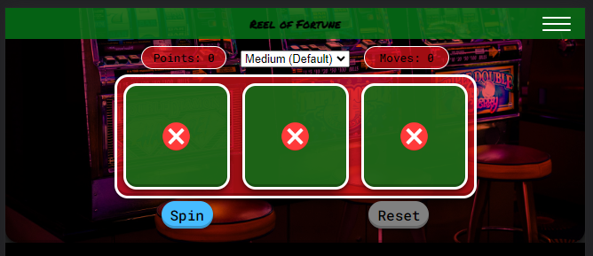
    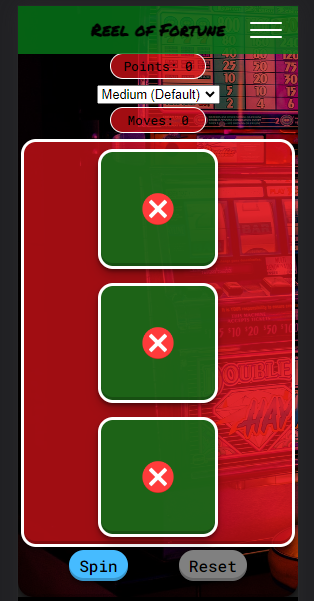

1. Contact Page

    - This page will display a contact form so end users can reach out to the game studio about any queries or if they find any bugs/errors/issues they wish to report

    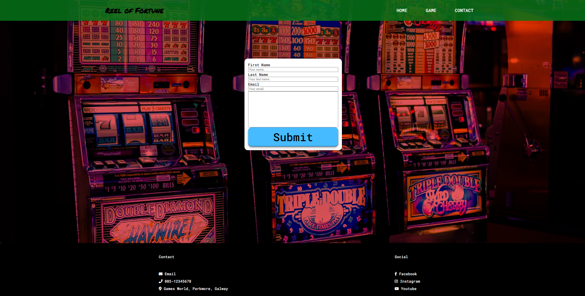
    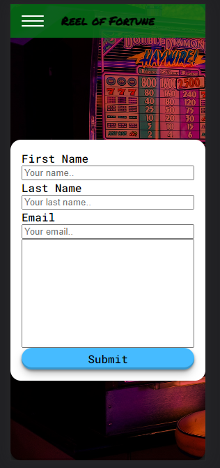

1. Thank You Page

    - This page is displayed after the form has been filled in, validated, and submitted

    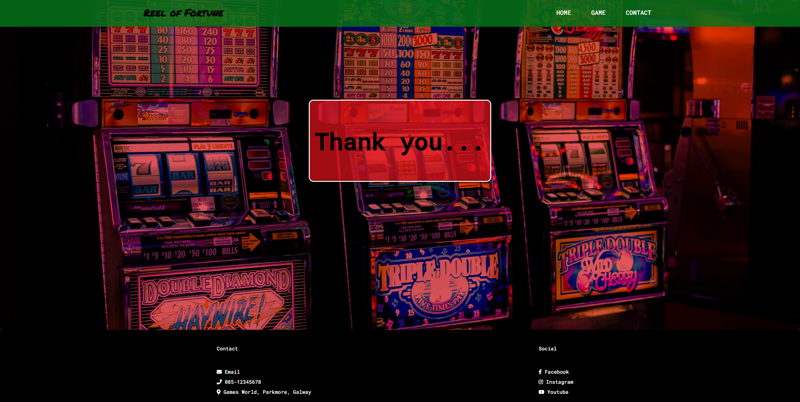
    
 
---

## Technologies used

- ### Languages:

    + [HTML](https://developer.mozilla.org/en-US/docs/Web/HTML): The markup language used to create the website
    + [CSS](https://developer.mozilla.org/en-US/docs/Web/css): The styling language used to style the website
    + [JavaScript](https://developer.mozilla.org/en-US/docs/Web/JavaScript) This was the main language used to create the game and for the form validation on the contact page

- ### Programming Paradigm

    + [Object Orientated Programming](https://codeinstitute.net/ie/blog/object-oriented-programming/): This was the paradigm I chose to complete this project. It involves classes and methods that are accessed to complete tasks of a desired outcome. 

- ### Other tools:

    + [GitHub](https://github.com/): This was used to host the source code of the website
    + [GitHub Pages](https://github.com/Ajfriel86/PilatesParadise/settings/pages): This was used to publish the files that were pushed to the repository
    + [VSCode](https://code.visualstudio.com/): This was the IDE used to develop the website
    + [Chrome DevTools](https://developer.chrome.com/docs/devtools/open/): This was used to debug the website
    + [Font Awesome](https://fontawesome.com/): This was used to create the icons used in the website
    + [Google Fonts](https://fonts.google.com/): This was used to import the font 'Maven Pro' that is used throughout the site
    + [Abobe Color-Wheel](https://color.adobe.com/create/color-wheel): This was used to create color swatches
    + [W3C Validator](https://validator.w3.org/): This was used to validate HTML5 code for the website
    + [W3C CSS validator](https://jigsaw.w3.org/css-validator/): This is used to validate CSS code for the website
    + [Responsive Viewer](https://chrome.google.com/webstore/detail/responsive-viewer/inmopeiepgfljkpkidclfgbgbmfcennb): This was used to check the responsive design of the site on various devices
    + [Jshint Validator](https://jshint.com/): This was used to validate the JavaScript code for this project
  

---
## Design

### Wireframes

#### Landing page:

#### Game page:

#### Contact page:

### Implementation of Design

    

## Testing

### Bugs

- 

- 

- 

- 

-  

- 

- 

### Performance

- 

- 

### Responsive Design

### Validation
#### HTML:
 - Landing Page:

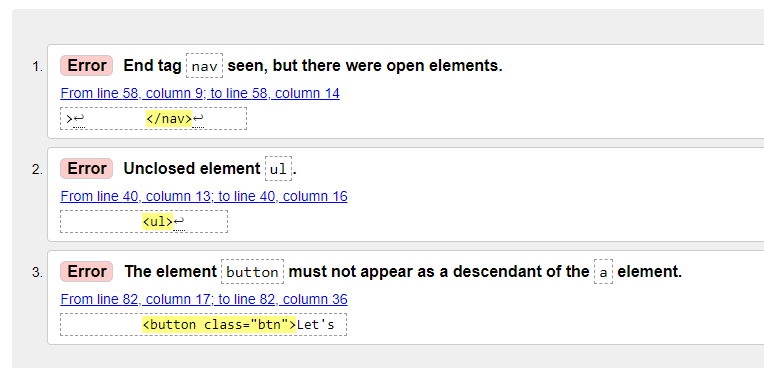
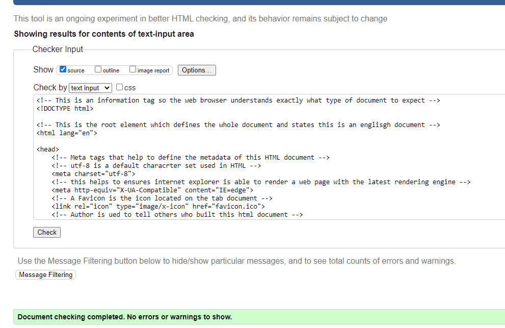

- Game Page:

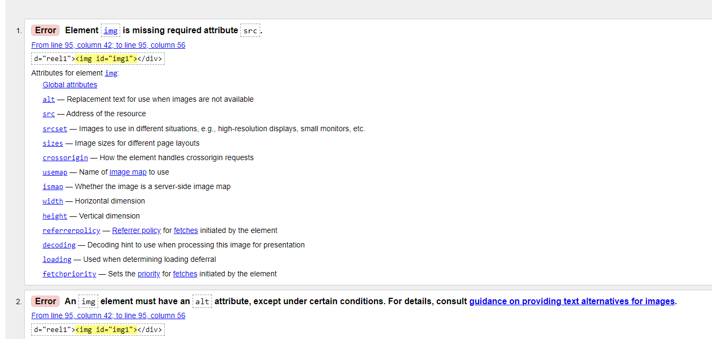
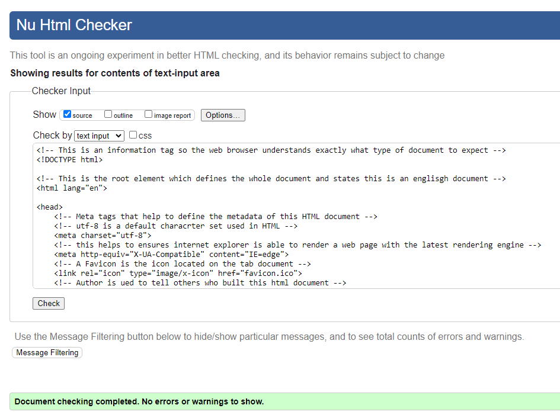

- Contact Page:

- Thank you page:

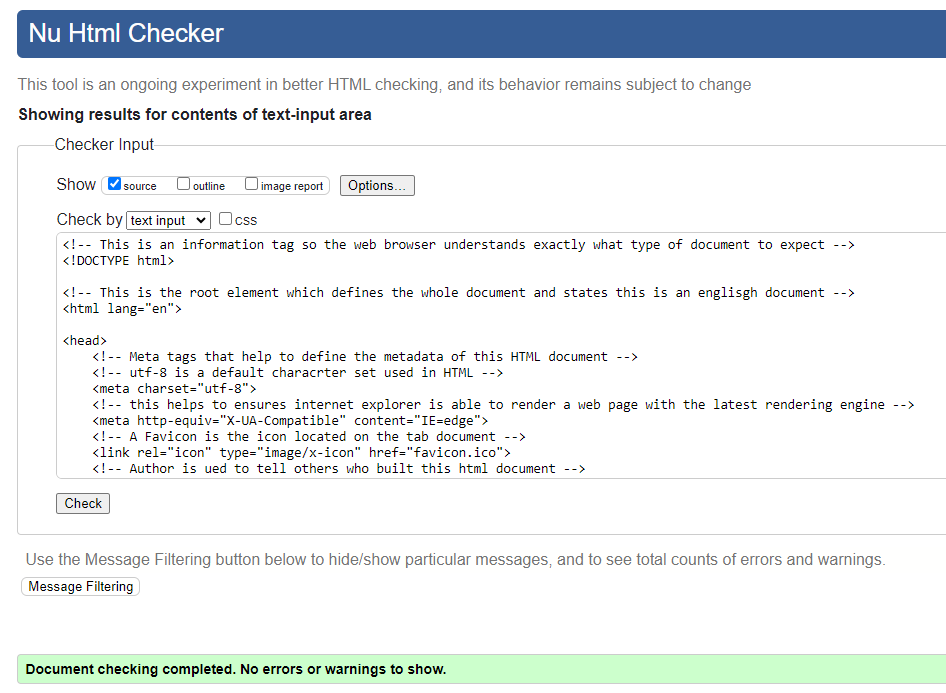

#### CSS:

- These errors were fixed as my decimal point was in the wrong spot

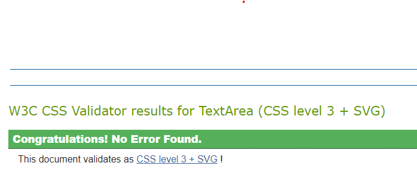

- These warnings are due to variables being used and the validator not being up to date to handle CSS variables

#### JavaScript:

- Some errors arose in JavaScript that were easily fixed by adding the semicolons, and declaring & defining the variables

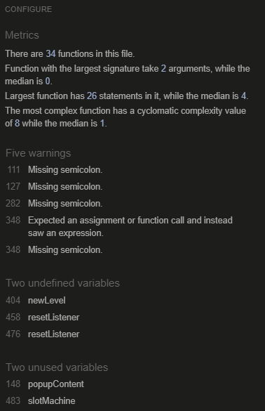

- With implemented fixes:

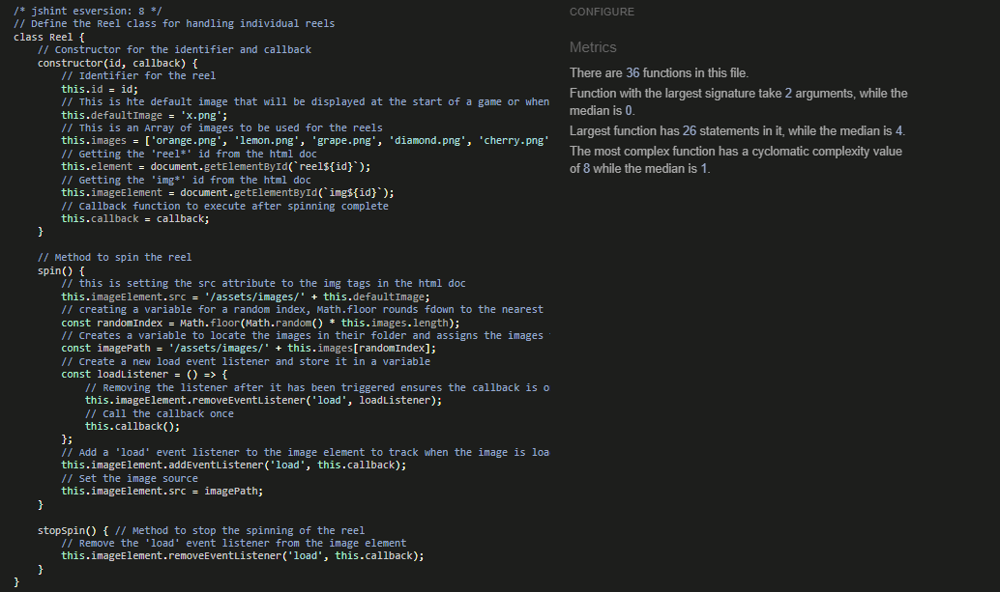

---

## Deployment

### Deployment to Git Hub Pages

This website was constructed in VS Code and deployed on GitHub. The steps taken to deploy this website from its [GitHub Repository](https://github.com/Ajfriel86/PilatesParadise) are as follows:

- Log into GitHub
- Go to the list of repositories on the left-hand side of the screen
- Click on the repository - [Reel Of Fortune](https://ajfriel86.github.io/ReelOfFortune/)
- Choose the settings tab from the menu items across the top of the page; it is the 9th tab on the menu items list.
- Under 'Code and automation,' the last choice on the list is 'Pages'
- In the 'Source' section, choose 'Deploy from a branch'
- In the 'Branch' section, choose the branch you wish to deploy
- Select, or click, the 'Save' button
- A link to the deployed website is then displayed at the top of the page

### How To Clone a GitHub Repository

- On GitHub.com, navigate to the main page of the repository
- Above the list of files, click <>  Code
- Copy the URL for the repository
- Open Git Bash
- Change the current working directory to the location where you want the cloned directory
- Type git clone, and then paste the URL you copied earlier
- Press Enter to create your local clone

These steps can where found in the help documentation for GitHub here:
- [Cloning a repository](https://docs.github.com/en/repositories/creating-and-managing-repositories/cloning-a-repository)

---

## Credits

   - [W3 Schools - HTML Elements](https://www.w3schools.com/html/html_elements.asp): This was used to understand the html tag is for
   - [W3 Schools - Doctype](https://www.w3schools.com/tags/tag_doctype.asp): This was used to understand what the Doctype tag is for
   - [Geeks for Geeks - http-equivx-ua] (https://www.geeksforgeeks.org/what-does-meta-http-equivx-ua-compatible-contentieedge-do/): This was used to understand the porperty http-equivx-ua-compatible
   - [HubSpot - utf-8](https://blog.hubspot.com/website/what-is-utf-8): THis was used to understand what utf-8 is
   - [Mozilla Viewport Meta Tag](https://developer.mozilla.org/en-US/docs/Web/HTML/Viewport_meta_tag): This was used to understand the Viewport in better detail
   - [W3 Schools - Meta Tags](https://w3schools.com/tags/tag_meta.asp): This was used to understand the meta tags in greater details 
   - [Ahrefs - Keywords](https://ahrefs.com/blog/meta-keywords/): This was used to understand keywords and SEO 
   - [Kevin Powell](https://www.youtube.com/watch?v=8QKOaTYvYUA&t=26s): This was used to create a responsive nav nar with no JS
   - [Mozilla - Header](https://developer.mozilla.org/en-US/docs/Web/HTML/Element/header): This was used to understand headers in more detail
   - [Mozilla - Nav-tag](https://developer.mozilla.org/en-US/docs/Web/HTML/Element/nav): This was used to understand nav tags in more detail
   - [Mozzila - HTML Markup](https://www.w3.org/TR/2012/WD-html-markup-20120329/ul.html): This was used to understand HTML markup in more detail
   - [W3 Schools - Anchor Tags](https://www.w3schools.com/tags/tag_a.asp): THis was used to understand anchor tags in more detail
   - [Cloning a repository](https://docs.github.com/en/repositories/creating-and-managing-repositories/cloning-a-repository): This was used to understand how to clone a repository

